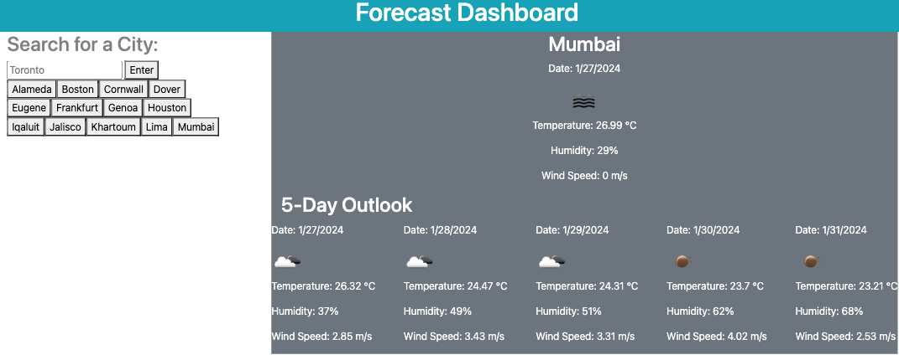

# Weather-App

## Description

A basic weather dashboard page to demonstrate usage of server-side APIs. This app uses the OpenWeatherMap API (free version) to serve current weather, and 5-day outlook for a city, which can be searched using the search bar.

## Link to Deployed Website

https://spec-tr.github.io/Weather-App/

## Technologies

### JavaScript
### HTML
### CSS

## Credits & Sources

Information and documentation used in the creation of this app, but external to the EdX UofT Full-Stack Software Development Bootcamp including syntaxes, best practises and instructional examples for usage came from the following sources:

- https://coding-boot-camp.github.io/full-stack/apis/how-to-use-api-keys
- https://getbootstrap.com/docs/4.3/utilities/spacing/
- https://getbootstrap.com/docs/4.3/utilities/colors/
- https://getbootstrap.com/docs/4.3/layout/overview/
- https://www.w3schools.com/jsref/api_fetch.asp
- https://openweathermap.org/current#data 

## License

See LICENSE file in repository
